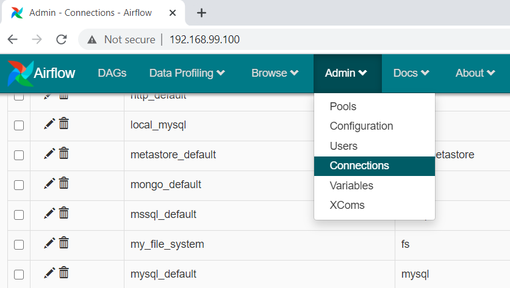
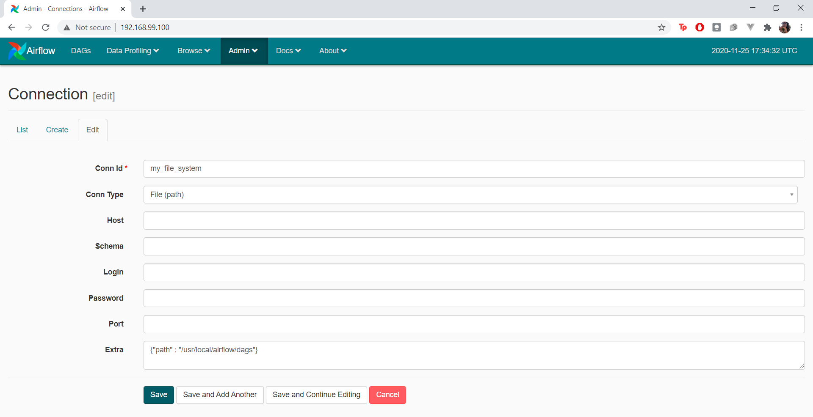
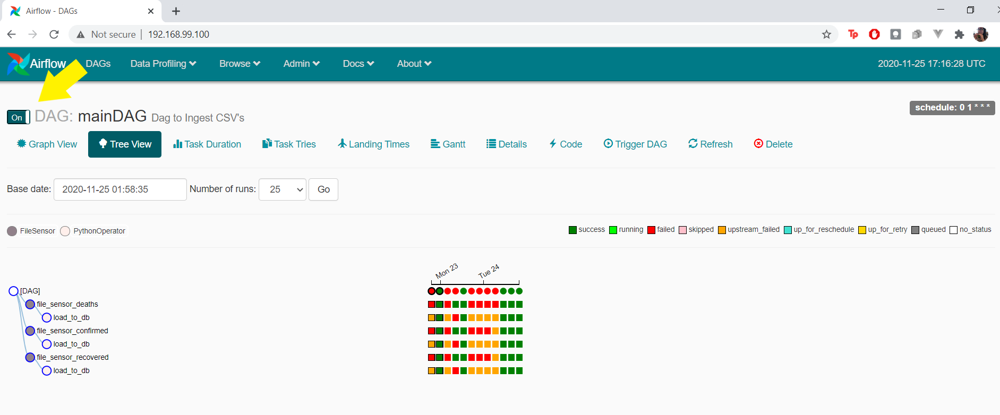
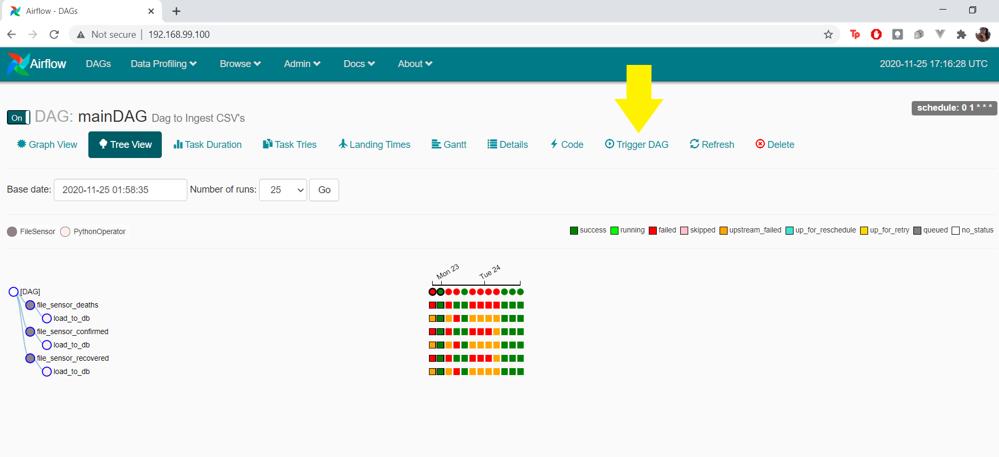
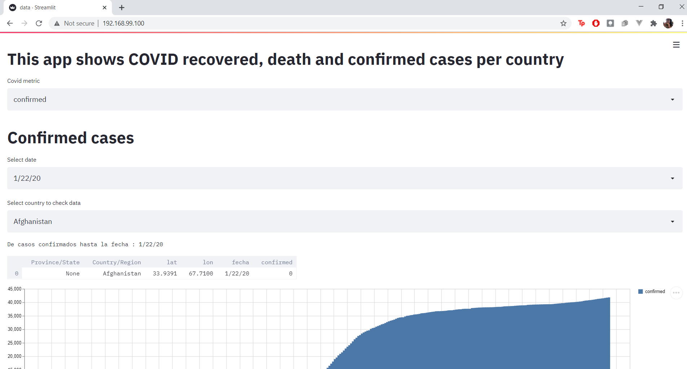

# Covid-Dashboard Pipeline

Data Products final project

* [About the Project](#about-the-project)
  * [Built With](#built-with)
* [Getting Started](#getting-started)
  * [Prerequisites](#prerequisites)
  * [Installation](#installation)
* [Usage](#usage)

## About the Project

The project consists of a data pipeline that processes 3 csv files, inserts them into a database, and then based on the processed data builds a dashboard that allows you to analyze the statistics of each of the files.

### Built With

* airflow
* docker
* docker-compose

## Getting Started

### Prerequisites

* docker
* docker-compose

### Installation

Clone the repo

```sh
git clone https://github.com/LinddM/Covid-Dashboard.git
```

## Usage

1. Build the project

```sh
docker-compose build
```

2. Run the project

```sh
docker-compose up
```

3. View the UI

Insert ```localhost:8080``` or ```<your-docker-machine-ip>:8080```<strong>**</strong> in your web navigator

    3.1 Check the connection

    3.1.1 Click Admin > Connections and search for "my_file_system"

  

    3.1.2 Try to edit "my_file_system" connection

  

  You should see something like this. If not, delete the connection and create it again

    3.2. Run the DAG

    3.2.1. Be sure to turn on the DAG

  

    3.2.2. Trigger the DAG

  

4. View the Dashboard

Insert ```localhost:8501``` or ```<your-docker-machine-ip>:8501```<strong>**</strong> in your web navigator



Here you can browse COVID-19 stats by metric, date and country

<strong>**</strong><i>To find you docker machine ip you can insert in the command line "docker-machine ip"</i>